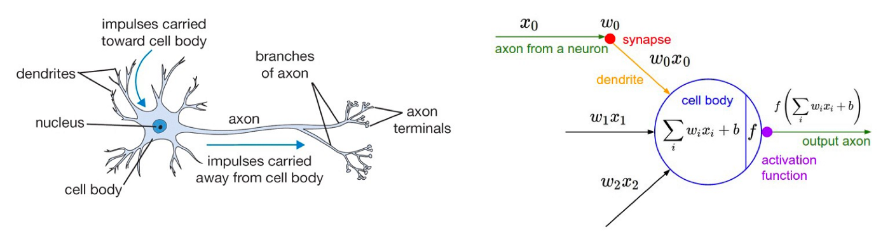
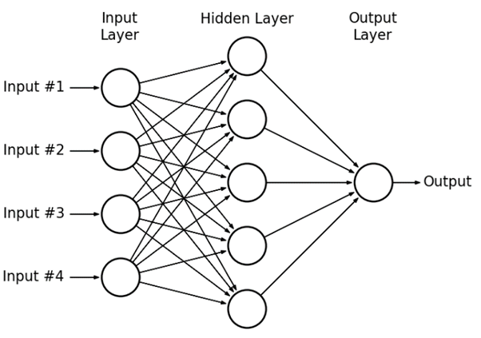
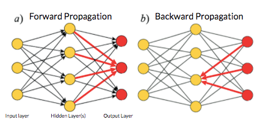

# SOC-Intro-to-Machine-Intelligence

## Neural Networks

As the name suggests, Neural networks (also called as Artificial Neural Networks ANN) are inspired by the neurons in the human brain.

•  Like a single unit in Neural Network is called Neuron, the single most basic unit in Artificial neural network is called Perceptron.

•  The various features of our dataset (independent values) are given as input x1, x2, x3,.... xn.

•  Each input feature is given a weight to determine how important it is.

•  Perceptron makes a decision y (dependent variable) on the basis of an activation function.

In this example, we have three layers-

•	Input layer

•	Hidden Layer

•	Output Layer

Whenever there are more than 3 layers (Input, Hidden, Output) in a Neural Network, we call it a deep Neural network.

Each layer helps in classifying, a certain aspect of the final output layer

## Activation Functions

They basically decide whether a neuron should be activated or not.

An activation function is a non-linear transformation that we do over the input before sending it to the next layer of neurons or finalizing it as output.

### Types of Activation Functions –

 • Step Function

 • Sigmoid Function

 • ReLU

 • Leaky ReLU

## Forward and Backward Propagation

•	Forward Propagation: Signal goes from input layers towards output layers

•	Backward Propagation: Signal goes from output to input layers

## Optimizing a Neural Network

•  Training Dataset: The sample of data used to fit (train) the model.

•  Validation Dataset: The sample of data used to provide an evaluation of model’s performance while tuning model hyperparameters.

•  Test Dataset: The sample of data used for the final evaluation of model’s performance.

## Overfitting and Underfitting:

Overfitting is a scenario where your model performs well on training data but performs poorly on data not seen during training.

A machine learning algorithm is said to have underfitting when it cannot capture the underlying trend of the data.

### Tackling Overfitting using Early Stopping, Regularization and Dropouts

### 1. Early Stopping

 • When training a large network, there will be a point during training when the model will stop generalizing and start memorizing or learning the noise in the training dataset i.e it will start overfitting which results bad performance when the model is exposed to unseen new dataset.

 • The challenge is to train the network long enough that it is capable of learning the mapping from inputs to outputs, but training should not be for so long that it overfits the training data.

### 2. Regularization

  •	Regularization is a technique which makes slight modifications to the learning algorithm such that the model generalizes better (Generalization refers to your model's ability to adapt properly to new, previously unseen data). This in turn improves the model’s performance on the unseen data as well.

  • Adding more than required layers might also lead to overfitting.

  •	In order to avoid overfitting, instead of simply aiming to minimize loss:
                           minimize(Loss(Data|Model))
    we'll now minimize loss + complexity, which is called structural risk minimization:
                minimize (Loss (Data | Model) + complexity(Model))

  •	L2 regularization term encourages weight values toward 0 (but not exactly 0) and the mean of the weights toward 0, with a normal (bell-shaped or Gaussian) distribution.

  •	L1 regularization—penalizing the absolute value of all the weights—turns out to be quite efficient for wide models.

### 3. Dropout:

  •  In Deep Neural Networks, the chances of overfitting are very high. Therefore, Dropout acts as a regularization to the NN. It makes the model more robust.

  •  The percentage of neurons to be dropped is a hyperparameter that can be tuned based on the amount of overfitting on the data.

  •  By dropping a unit out, we mean temporarily removing it from the network, along with all its incoming and outgoing connections.

## Convolutional Neural Network

•	To teach an algorithm how to recognise objects in images, we use a specific type of Artificial Neural Network: a Convolutional Neural Network (CNN). Their name stems from one of the most important operations in the network: convolution.

•	The word convolution refers to the filtering process that happens in this type of network. In literal terms, it is a mathematical operation that makes filtering possible

### Regular Neural Networks:

•	Transform an input by putting it through a series of hidden layers.

•	Every layer is made up of a set of neurons, where each layer is fully connected to all neurons in the layer before.

•	Finally, there is a last fully-connected layer — the output layer — that represent the predictions.

### In CNNs:

•	The layers are organised in 3 dimensions: width, height and depth.

•	The neurons in one layer do not connect to all the neurons in the next layer but only to a small region of it.

## Reinforcement Learning

### What is reinforcement learning?

In a way, Reinforcement Learning is the science of making optimal decisions using experiences. Breaking it down, the process of Reinforcement Learning involves these simple steps:

1.	Observation of the environment

2.	Deciding how to act using some strategy

3.	Acting accordingly

4.	Receiving a reward or penalty

5.	Learning from the experiences and refining our strategy

6.	Iterate until an optimal strategy is found

### Common reinforcement learning algorithms

•	**Q-learning**. This approach to reinforcement learning takes the opposite approach. The agent receives no policy, meaning its exploration of its environment is more self-directed.

•	**Deep Q-Networks**. These algorithms utilize neural networks in addition to reinforcement learning techniques. They utilize the self-directed environment exploration of reinforcement learning. Future actions are based on a random sample of past beneficial actions learned by the neural network.

### OpenAI Gym

OpenAI gym is an environment for developing and testing learning agents. It is focused and best suited for reinforcement learning agent but does not restricts one to try other methods such as hard coded game solver / other deep learning approaches.

